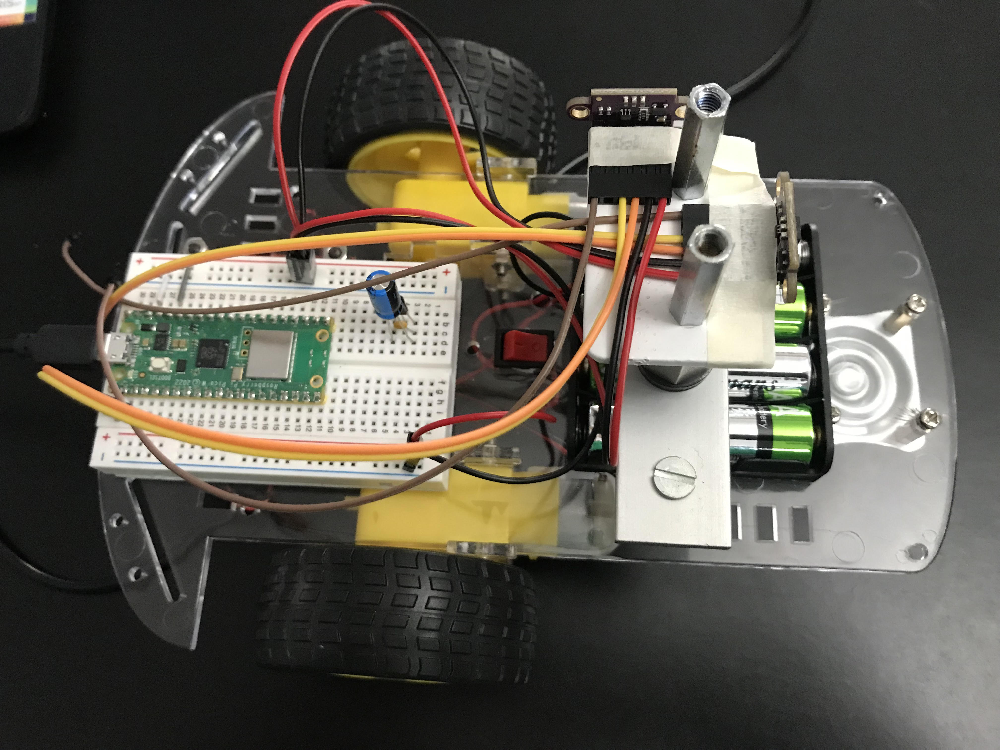
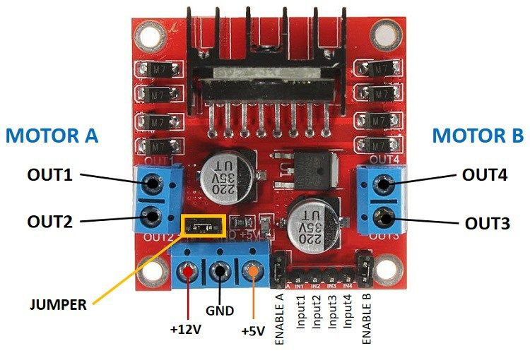
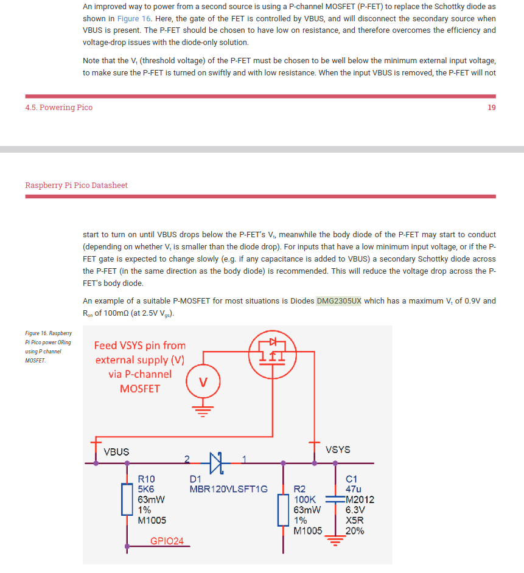
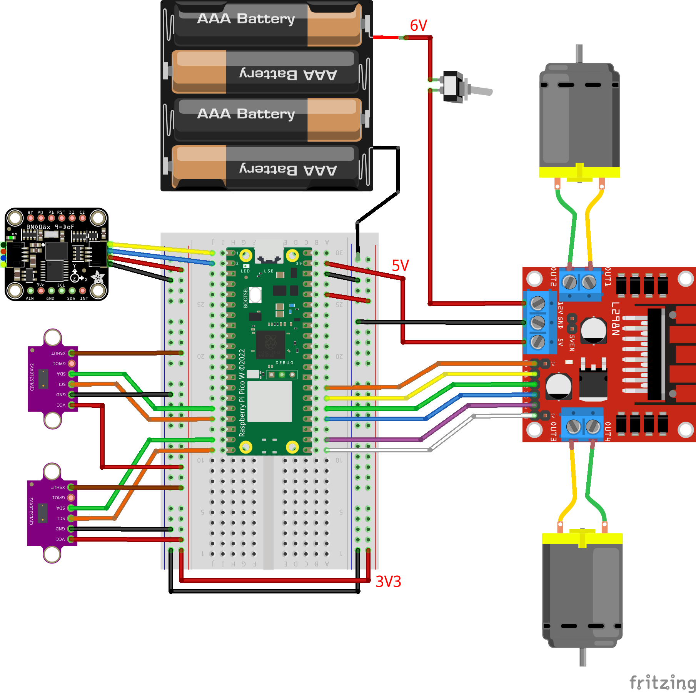
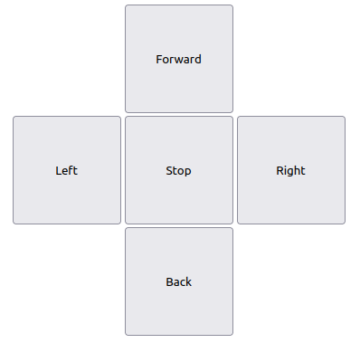
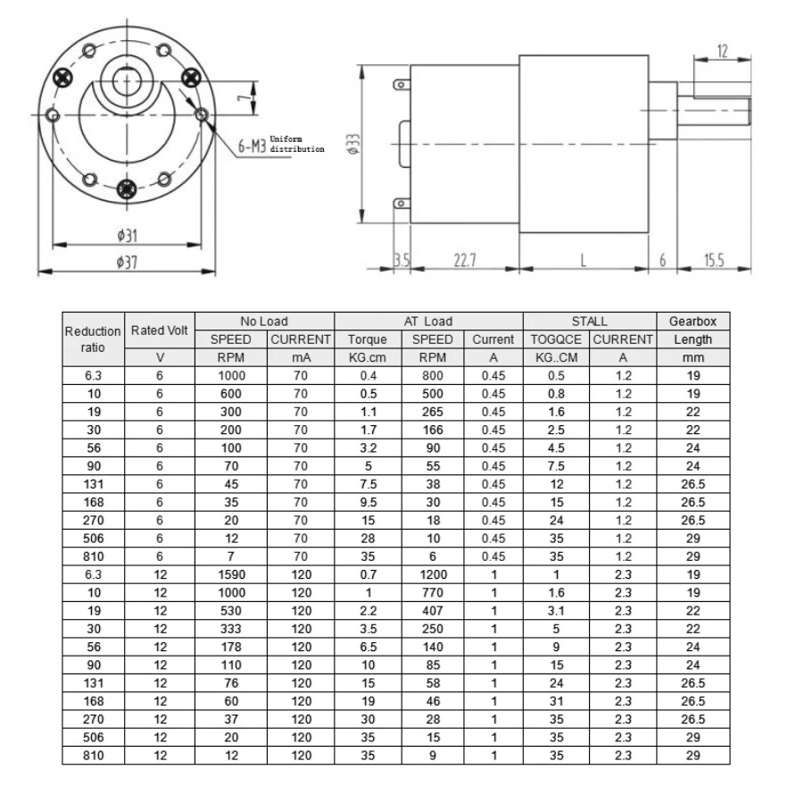
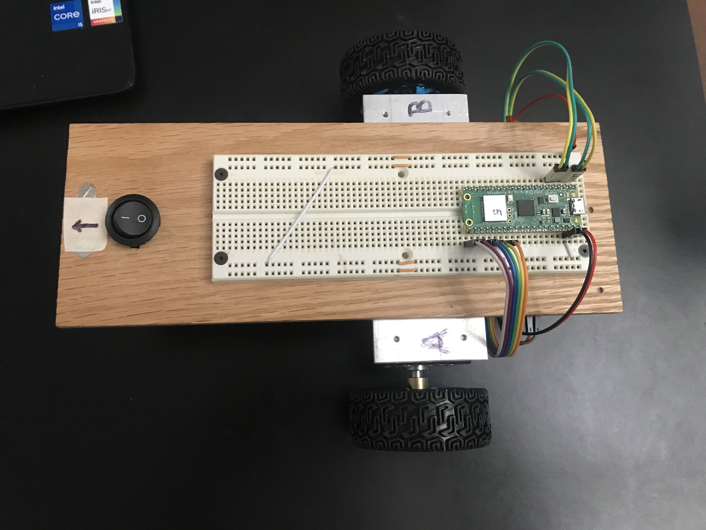
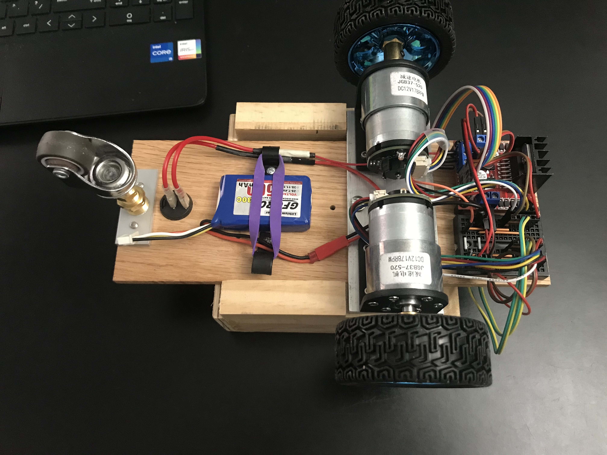
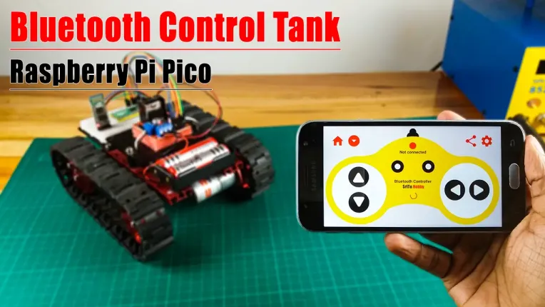

# Pico-&mu;Python Smart Car Project

### This Medium article by Dan McCreary [Raspberry Pi Pico Robot in Micropython](https://dmccreary.medium.com/raspberry-pi-pico-robot-in-micropython-51f956486270) inspired me to buiild a similar smart car project
* Further details are presented at [base robot kit project](http://www.coderdojotc.org/micropython/robots/02-base-bot/)
    * Discovered they use [MkDocs](https://www.mkdocs.org/getting-started/). May want to check this out sometime...

### My project will use **at least 2** of these time-of-flight VCSEL sensors

* Googled for info about Using the Raspberry Pi Pico with 2 x VL53L0x in Micropython
    * Found this [Orionrobots video](https://www.youtube.com/watch?v=XQrxPcq2tZ8) which shows:
        * Using two devices, one on each I2C bus
        * How to modify device address in order to have multiple devices on the same bus
        * in both cases, it is important to hold the XSHUT pin high.
    * The library used by Orionrobots is based on Kevin McAleer's [Raspberry Pi Pico & VL53L0X for MicroPython](https://www.youtube.com/watch?v=YBu6GKnN4lk)
    * Unfortunately, The library used (by both Kevin McAleeer and the derivative Orionrobots) only produces values up to 500 mm.
        * Whereas the datasheet shows the VL53L0X should produce data up to 1200 mm.
        * The VL53L0X library (used by McCreary) produces values all the way to 1200 mm. 
            * A diff shows that the libraries used by McAleer (and Orionrobots) is actually a mofified version of the one used by McCreary.
* I thought I would try using the **disparity** of two forward-looking but obliquely oriented (pigeon-toed) sensors as a way to enable the cheap *smart-car* to steer toward a wall along a path that is perpendicular to the wall. This proved to be quite difficult.
    * Without motor encoders, it is very frustrating trying to control steering on differential drive configuration.
    * The motors have a large and varialble amount of static friction, causing the actual motor speed to be unknowable. 
    * Sometimes, the friction is so large, that a motor won't start to turn even with a PWM duty cycle of (40_000 / 65_536)
    * Decided to not pursue this approach any further.
* Instead, I decided to use the Bosch BNO08x IMU sensor in RVC mode to keep track of the car's yaw angle.
* I will use the VCSEL sensors just for distance measurement

### Use the Bosch BNO08x IMU sensor to keep track of the car's **yaw** angle

* I found this [MicroPython library](https://github.com/rdagger/micropython-bno08x-rvc/blob/master/bno08x_rvc.py) (based on this [CircuitPython library](https://github.com/adafruit/Adafruit_CircuitPython_BNO08x_RVC)) which enables access to the BNO08x IMU module (in RVC mode) over the UART serial bus.
* (Truth be known, I was having a bit of difficulty figuring out how to attach more than one device to the I2C bus, so I decided to just sidestep this issue and connect over UART.)
* This primer on [Raspberry Pi Pico Serial Communication Example(MicroPython)](https://electrocredible.com/raspberry-pi-pico-serial-uart-micropython/) provided the detailed understanding I needed to get it all working.

### Use the [L298N motor driver module](https://www.etechnophiles.com/l298n-motor-driver-pin-diagram/)

* Used on my ROS robot and it worked well, so I will use that again.

### Power to the pico will come from 2 different sources:
    1. The USB connection (5V)
    2. The 5V power output from the motor driver board
    
* The Pico datasheet shows a recommended way to accomodate power from 2 sources:

* I ordered the P-FET but until it comes, I have hooked up the 5V output from the motor driver board directly to the VSYS pin of the pico, as shown in this wiring diagram. It seems to work OK both with / without the USB connection to the Pico.

* This video [Power for the Raspberry Pi Pico - Guide to using VBUS, VSYS and 3V3 for external power circuits](https://www.youtube.com/watch?v=3PH9jzRsb5E) reccomends using a Schotkey diode (1N5817) to allow connecting an external 5V supply to VSYS while the PICO is simultaneously connected to USB power.

### Add WiFi control

Bob Grant ([Bytes N Bits](https://bytesnbits.co.uk/S)) has produced this series of [3 video tutorials](https://www.youtube.com/playlist?list=PLvOT6zBnJyYGLmvrJeYzRYwBFa44SVnLZ) which teach how to build a web interface for controlling a project on the Pi Pico W.
* WiFi Control Your Micropython Project Using a Web Interface
    * [Youtube video](https://www.youtube.com/watch?v=eym8NpHr9Xw)
    * [Bytes N Bits web page](https://bytesnbits.co.uk/simple-micropython-wifi-connection/)
    * [Github Repo](https://github.com/getis/pi-pico-w-simple-wifi-setup)

* Web Control Panel Part 1: Add a web control panel to your project - the web server
    * [Youtube video](https://www.youtube.com/watch?v=h18LMskRNMA)
    * [Bytes N Bits web page](https://bytesnbits.co.uk/web-control-panel-web-server/)
    * [Github Repo](https://github.com/getis/micropython-web-control-panel)

* Web Control Panel Part 2: Asyncio & Dual Core web server
    * [Youtube video](https://www.youtube.com/watch?v=PY732g2ZN4g)
    * [Bytes N Bits web page](https://bytesnbits.co.uk/web-control-panel-2-asyncio-dual-core/)
    * [Github Repo](https://github.com/getis/micropython-web-control-panel)

* Web Control Panel Part 3: Web Page & Javascript coding
    * [Youtube video](https://www.youtube.com/watch?v=Z6g9x170Pvw)
    * [Bytes N Bits web page](https://bytesnbits.co.uk/web-control-panel-web-page/)
    * [Github Repo](https://github.com/getis/micropython-web-control-panel)

But first, just to get started, I will use a more primitive, basic web control interface.
Christopher Barnatt shows a very simple [Pi Pico W WiFi Controlled Robot](https://www.explainingcomputers.com/pi_pico_w_robot.html)
* The robot runs a basic webserver displaying a very simple form with 5 buttons.

This looks just right for this project. Simple and straightforward. I just need the webserver to run asynchronously so it doesn't block the robot's navigation code.
* `pico_car+webserver.py` combines the web interface code the navigation code bundled together.

## Pause for project assessment

At this point, I have a nice, cheap mobile car platform for testing various robot-related concepts. And it is all running on the PICO-W.

Right now, if I set the car on the floor and turn it on, and then go to my laptop and browse to the car's webserver url (192.168.1.64), I get the car's 5-button navigtation panel.
* If I click the **Back** button, the car drives in reverse and it uses the PID feedback from the IMU to drive roughly straight in reverse (with some minor steering oscillations) until it arrives to within  250 mm of a wall.
* However if I click on the **Forward** button, the car goes forward, but drives as if it had a *steering wheel* that was turned 90 degrees to the left.
    * The left wheel was runnning slower than the right one.
    * Probably due to friction (I thought)
    * One possible cause was that the face of the left wheel hub was rubbing more against the motor housing, so I pried the wheel hubs away from the motor housing to create a small gap, but the problem persisted.
    * Whatever the cause of the difference in performance between the left and right motors, it is pointless to chase it down. There will always be differences.
    * Using yaw angle feedback from the IMU, I can get the car to drive straight in both the forward and reverse directions, but when turning in place, I won't know that both motors are turning (at the same speed).
        * For this reason, I decided that the motors must have encoders and the PID feedback from the encoders must be used to regulate the motor drive signals.
        * This of course, is the configuration of the ROS mobile robot, which makes further use of the encoder information to accurately compute odometry.

> The cute little yellow motors that come on the **DIY Smart Car** are altogether **inadequate** for use on a DIY robot. Any serious robot project must have motor shaft encoders and a gearbox with a reduction of roughly 30 to 40x.

## Find inexpensive gear motors with encoders for the Pico Car

I have been down this road previously and the best motors/wheels I found were the ones used by the Elegoo Tumbller. For the ROS robot, I wanted a higher gear reduction and ended up using motors with a 100:1 worm drive gear box.

For this project, I am not convinced that I need a different gear reduction, so I will proceed with the motors/wheels used by the Tumbller. I found them available for $12 apiece on [Aliexpress](https://www.aliexpress.us/item/2251832832394397.html?gatewayAdapt=glo2usa4itemAdapt) and [ordered 2](aliexpress-order/aliexpress-order.pdf).  There is a chart that shows various gearabox options. The Tumbller motor has a 30:1 gearbox with a length of 22 mm. Higher gear reductions can be gotten but have a greater length.  When I was looking for higher reduction motors for the ROS robot, I hadn't found these motors from Aliexpress. Looking at the Tumbller, it looks like there is enough room for the 24 mm length gearbox. So I could choose either 56:1 or 90:1 gear reductions.

The motors come with a 6-wire harness which needs to be hooked up as follows:

- Red Wire - positive power supply of motor(+)(change positive and negative of motor the rotation will change)
- White Wire - negative power supply of motor(-)(change positive and negative of motor the rotation will change))
- Yellow Wire - signal feedback (motor one turn has 11 signals)
- Green Wire - signal feedback (motor one turn has 11 signals)
- Blue Wire - positive of encoder power supply(+)(3.3-5V),cannot be wrong
- Black Wire - negative of encoder power supply(-)(3.3-5V),cannot be wrong

## Program PICO to listen to encoder pulses on interrupts

Using the method shown in this video [Using PICO interrupts](https://www.youtube.com/watch?v=9Fio0BlMsVM), Chris DeHut shows how to set up the PICO to listen to encoder pulses.

* In the video, he has a link to the [code](https://makingstuffwithchrisdehut.com/electronics-files) which looks like an absolute gold mine of useful code for the PICO.

* For example, there are files there named: "encoders" and "analog joystick".
Those look like they would be worth looking at...

I found a collection of [Awesome MicroPython](https://awesome-micropython.com/#rotary-encoder) libraries which contains an encoder primer by Peter Hinch at this [repo](https://github.com/peterhinch/micropython-samples/blob/master/encoders/ENCODERS.md)
* He has written an [encoder library specifically for the Pico](https://github.com/peterhinch/micropython-samples/blob/master/encoders/encoder_rp2.py)
    * It uses some PIO and State Machine code (over my head) but seems to work very well, so I decided to use it. 
        * It counts **52 pulses per rev** which is likely counting both rising and falling edges of both sensors. (13 poles x 4)
        * This differs from the *"11 signals per rev"* quoted by the spec sheet (above).

## Pause again to evaluate project progress

* The car has been completely rebuilt to replace the little yellow smart car motors with the Tumbller motors. However, the new motors still have intrinsic differences that cause the car to turn excessively when intending to drive straight with the application of equal PWM signals.
* I replaced the 4-pack of AA batteries with a LiPo 3S 50C battery. This was to remedy the problem that as the AA batteries got a little tired, the 5V PS on the L298N was unable to provide 5V out and therefore was unable to power the Pico.
    * This solved the problem with the L293N P/S, but now the motors run much **faster** than they need to, so in order to operate at a moderate speed, a lower PWM signal is needed.

* I have received and installed the motors I ordered from AliExpress. (3 weeks from order to arrival)
    * It turns out they are the 56:1 motors.
    * This gear reduction works very well.
        * The cruising speed of the car is fine with the LiPo battery 
        * In-place turning works great with lower PWM values.
        * Decided to order another pair (spares)
    * For now, I drive the motors at a target tick rate of 4000 ticks/sec by applying an individual multiplier for each motor to arrive at a PWM signal that runs them both at approximately the same speed.
        * The PWM signals are in the vicinity of 50_000 (max value = 65,535)

* I am still using the 5-button web interface (asynchrouous) to control the car. This works OK, but it is pretty bare bones. I might want to explore a joystick for speed and direction control.
* I removed the VCSEL sensors and the IMU (for now) while I focus on getting the motors to use PID feedback from the encoders to drive at a target tick rate.

## Learn how to create and display an [onscreen joystick](https://www.cssscript.com/onscreen-joystick/#google_vignette)

Looked online for examples of onscreen joysticks and found a few:

* Roberto D'Amico (bobboteck) [on github](https://github.com/bobboteck/JoyStick)
    * [Multi-joystick demo](https://bobboteck.github.io/joy/joy.html)
    * My initial attempt at implementing a [single joystick](/home/doug/pico-projects/joystick/JoyStick-master/joy_single.html)
    * Google Ad showing [single joystick example](https://www.cssscript.com/demo/onscreen-joystick/)
* [Another joystick demo](https://jsfiddle.net/aa0et7tr/5/)
    * [My implementation](/home/doug/pico-projects/joystick/pure_js_joystick/combined.html)

In order to examine and revise these, I first need to spin up on javascript and CSS [W3schools JS Tutorial](https://www.w3schools.com/js/default.asp)

I like the bobboteck example but it has a lot of extra "cruft" associated with showing how to display multiple joysticks. The Google ad does a nice job of getting rid of the unwanted cruft but adds their own extra stuff.

I copied the source of the Google page into the bobboteck folder [here](/home/doug/pico-projects/joystick/JoyStick-master/google_ad.html) and removed the Google Ad stuff while keeping the intrinsic simplicity of the code. It works fine and seems pretty clean.

Next up, I want to try using this joystick to control the Pico-car.

#### Other joystick projects

* [Send joystick data over BT](https://srituhobby.com/how-to-make-a-bluetooth-control-tank-with-raspberry-pi-pico-board/)

## Learning more about javascript and REST APIs

Looking at the javascript code in Bob Grant's code and the javascript code in the joystick examples makes me realize that I don't have a good fundamental understanding about how javascript works. To remedy this, I need to learn more about how javascript frontends work.

* I found [Full Stack Python](https://www.fullstackpython.com/javascript.html) which has some links that look good.

* Also found this RealPython tutorial [Python and REST APIs: Interacting With Web Services](https://realpython.com/api-integration-in-python/)

* Also [Python REST API: Build and Deploy Your Own Custom Server](https://www.xingyulei.com/post/py-http-server/)

* More Google searches on:
    * "How to create REST API in Python without flask"
    * "micropython rest api pico"
* Decided to put the joystick idea *on the shelf* for now.

## Implement closed loop feedback motor speed control

* Wheel diameter = 2.682 inches (68.12 mm)
* Use encoder pulses in proportional feedback loop to control speed while driving forward and backward
* Using `encoder_test.py`, I found 2464 ticks for each revolution of the wheel.

| Factor | Source |
| ---- | ---- |
| 56 x | gear reduction |
| 11 x | magnetic poles on rotor |
|  4 x | detecting both rising and falling edges from 2 (quadrature) sensors |
| 2464 | Total (ticks per wheel rev) |

| Value | Parameter |
| ---- | ---- |
| 0.214 | Wheel circumference (meters) |
| 11_514 | ticks per meter |

* Even after optimizinging PID coefficients, there is still some visually detectable *wiggle* in the car's steering as it begins driving straight forward or backward.
    * Small differences in friction between the 2 motors cause them to come up to speed differently even under the control of the feedback loop.
    * To reduce this steering wiggle, I will try adding a 4th term (C) to the controller, minimizing the difference between the encoder counts of the two motors.
    * Adding a 'C' term makes the PID controller into a PIDC controller.
    * The C term keeps track of the cumulative tick counts for both motors, urging them to stay in lock step.
* To implement this, a single instance of the new motors.Motors class replaces the 2 instances of motor.Motor class. 
    * P (proportional)
    * I (integral)
    * D (Derivative)
    * C (count difference a / b)
* Got this working in both Forward & Back directions.
    * The steering wiggle is no longer visually noticeable.
    * Performance data of some 1 meter runs (FWD & BACK) are shown in [spreadsheets folder](spreadsheets).

## Other refinements

* Added Odometer class, which updates pose each time through the main loop.
    * `pose = Odometer.update(enc_a.value(), enc_b.value())`
    * `pose_x, pose_y, pose_angle = pose`
* Using pose_angle, left and right buttons can now turn to a goal_angle.
* Using encoder_values, driving forward and back can go to a goal_distance.

